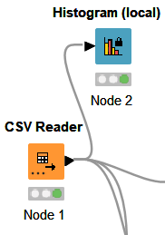
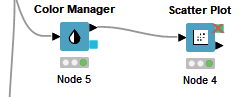
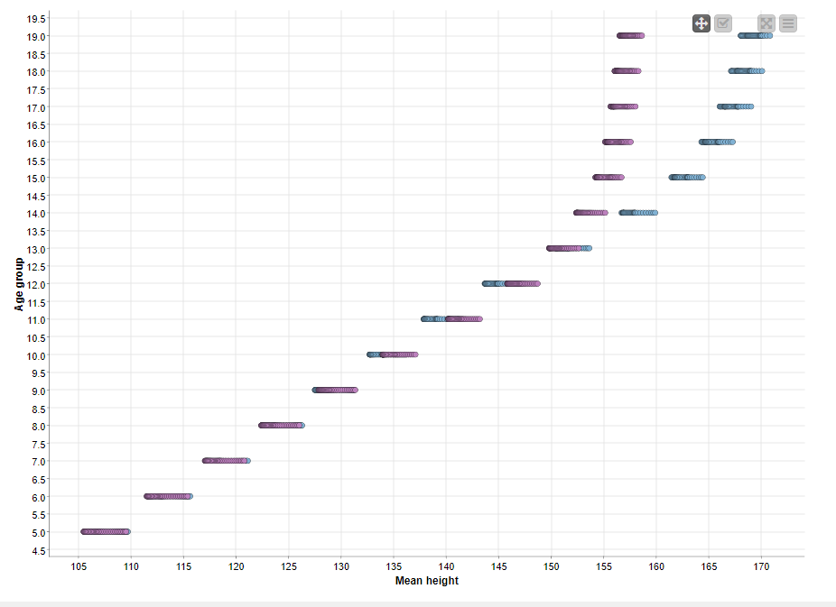
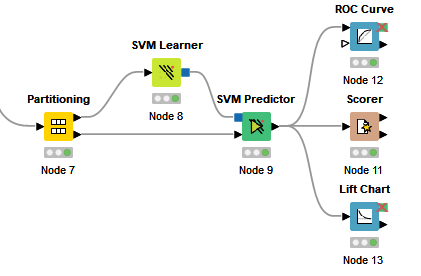
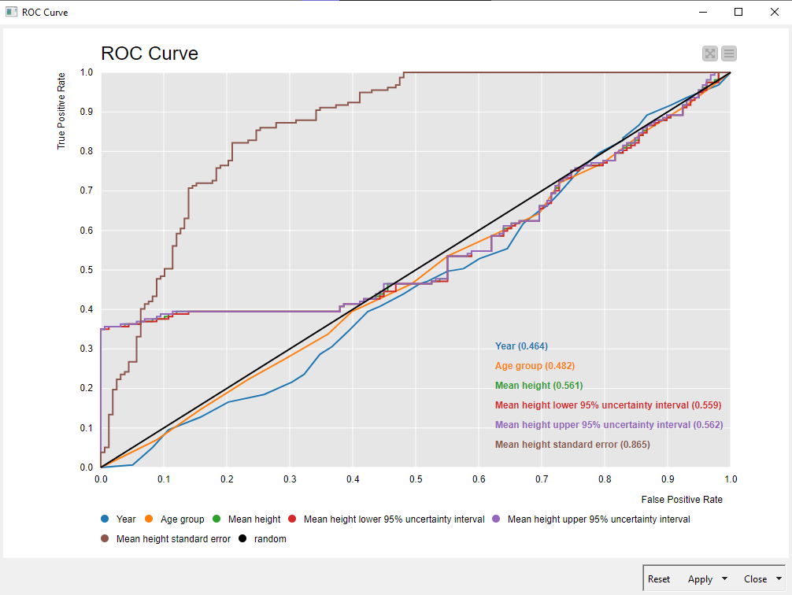
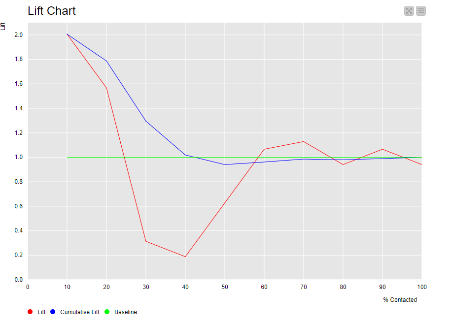

# AI-2023-Project
children heights over time 

## Overview
The project is about seeing how children height changes over time from year 1985 till 2019.

The purpose of calculating children heights over time can serve several purposes, including:

1. Understanding changes in human health and nutrition: Changes in adult height can reflect changes in the quality and quantity of food, access to healthcare, and general living conditions over time. By analyzing height data over time, researchers can better understand how changes in these factors have impacted human populations.

2. Assessing population health: Height is a useful measure of overall population health because it is influenced by a range of factors, including genetics, nutrition, and disease. By tracking adult height changes over time, researchers can gain insights into the health of populations, including trends in chronic disease, infectious disease, and other health conditions.

3. Identifying health disparities: Changes in adult height can also highlight disparities in health outcomes across different populations. For example, if certain groups consistently have shorter heights than others, it may indicate that they are experiencing higher rates of malnutrition, disease, or other health challenges.

4. Evaluating the effectiveness of health interventions: Finally, tracking adult height changes over time can help researchers evaluate the effectiveness of health interventions, such as nutrition programs or healthcare access initiatives. By comparing height data before and after the intervention, researchers can assess whether the intervention has led to improvements in overall health and well-being.

## Tool
* KNIME

## Nodes being used in KNIME
* CSV Reader
* Histogram
* Color Manager
* Scatter Plot
* Partitioning
* SVM Learner
* SVM Predictior
* ROC Curve
* Scorer
* Lift Chart

## Data Understanding
1. Import data by CSV Reader node, then make it easier to see using the Histogram node.

  

2. Using the Color Manager to differentiate between boys and girls in the dataset 

  

and use the Scatter Plot to visualize the relationship between Age group and the mean hieght 

  

3. use the Partitioning node to divide the dataset into smaller subsets

  

4. SVM Learner node is used for classification tasks, particularly in cases where the data has a non-linear relationship.

5. SVM Predictor node is used to make predictions on new, unseen data using a trained Support Vector Machine (SVM) model.

6. ROC Curve node is used to visualize the performance of a binary classification model and to evaluate its overall effectiveness.

  

7. Scorer used to compare the predicted results to the actual results, and compute various performance metrics.

8. Lift Chart node is used to visualize the performance of a machine learning model and to evaluate its effectiveness.

  

## Author
RANA LORDENG
